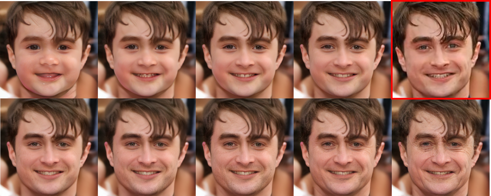

## AgeTransGAN &mdash; Official Pytorch Implementation




**Samples:** *Made by the AgeTransGAN for age regression and progression. The face in the red bbox is the input, and the rest are generated aged faces, all in 10242 pixels.*

**Abstract:** *We propose the AgeTransGAN for facial age transformation and the improvements to the metrics for performance evaluation. The AgeTransGAN is composed of an encoder-decoder generator and a conditional multitask discriminator with an age classifier embedded. The generator exploits cycle-generation consistency, age classification and cross-age identity consistency to disentangle the identity and age characteristics during training. The discriminator fuses age features with the target age group label and collaborates with the embedded age classifier to warrant the desired age traits made on the generated images. As many previous work use the Face++ APIs as the metrics for performance evaluation, we reveal via experiments the inappropriateness of using the Face++ as the metrics for the face verification and age estimation of juniors. To rectify the Face++ metrics, we made the Cross-Age Face (CAF) dataset which contains 4000 face images of 520 individuals taken from their childhood to senior hood. The CAF is one of the very few datasets that offer much more images of the same individuals across large age gaps than the popular FG-Net.We use the CAF to rectify the face verification thresholds of the Face++ APIs across different age gaps. We also use the CAF and the FFHQ-Aging datasets to compare the age estimation performance of the Face++ APIs and an age estimator made by our own, and propose rectified metrics for performance evaluation. We compare the performance of the AgeTransGAN and state-of-the-art approaches by using the existing and rectified metrics.*


## Test and Demo
We offer two versions of our AgeTransGAN, one for 10-age-group and the other for 4-age-group. You can enter your image as the input and our AgeTransGAN generator will generate 10 or 4 aged faces as output by the following steps (it requires Linux, Python 3.6, Cuda 10.1, Pytorch 1.40, Tensorflow 2.10):

1. Change the default input image 1.jpg in [./test/run_10group.sh](./test/run_10group.sh) or [./test/run_4group.sh](./test/run_4group.sh) for using the 10-group generator or 4-group generator. 
```
> ./test/run_10group.sh
python main.py --img_size 1024 --group 10 --batch_size 16 --snapshot ./snapshot/ffhq_10group_910k.pt --file img/1.jpg
deactivate
```
```
> ./test/run_4group.sh
python main.py --img_size 1024 --group 4 --batch_size 16 --snapshot ./snapshot/ffhq_4group_750k.pt --file img/1.jpg
deactivate
```
2. Run the test code with `./test/run_10group.sh` or `./test/run_4group.sh`.

3. The outputs are written to a new directory  `/test/result/<10>-<4>`.

4. You can also use a camera to take a face as input for a live synthesis. Please run the code with `./demo/run_10group.sh` or `./demo/run_4group.sh`.

## Use of Face++ APIs
The steps of using the Face++ APIs for estimating the age of a face image are as follows:

1. Open [./faceplusplus_evaluation-master/age.sh](./faceplusplus_evaluation-master/age.sh) and [./faceplusplus_evaluation-master/face_verification.sh](./faceplusplus_evaluation-master/face_verification.sh), and enter the key.
```
-F "api_key=[Yours]" \ -F "api_secret=[Yours]" \
```

2. Run the above code and obtain the csv files:
```
./age.sh [Folders for specific age groups] [Corresponding csv files]
./face_ verification.sh [Folders for specific age groups] [Folders for original images] [Corresponding csv files]
```
## Use of Age estimator
Use our age estimator, first download the pretrained weight:
[Age estimator](https://drive.google.com/file/d/1_CIp-diGwfBgc-aRBfRkAZP4QuVmxXmf/view?usp=sharing)

Put the pretrained under  `/age_estimator/weights/mean_variance_ffhq`

Than run the `main_test.py` and obtain the csv files as follows:
```
python main_test.py
```

## Perfromance
The table shows performance on FFHQ-Aging for transferring Group-5 to other 9 groups, estimate age with our estimator and Face++. We also shows the defined threshold for each group to caculate our face verification rate.
<table>
   <tr>
      <td>Age group</td>
      <td>0-2</td>
      <td>3-6</td>
      <td>7-9</td>
      <td>10-14</td>
      <td>15-19</td>
      <td>30-39</td>
      <td>40-49</td>
      <td>50-59</td>
      <td>70+</td>
   </tr>
   <tr>
      <td colspan="10" align="center">Average of Estimated Age</td>
   </tr>
<!--    <tr>
      <td>Raw data</td>
      <td>8.8</td>
      <td>18.0</td>
      <td>24.4</td>
      <td>26.0</td>
      <td>26.5</td>
      <td>40.1</td>
      <td>51.9</td>
      <td>64.7</td>
      <td>74.8</td>
   </tr> -->
   <tr>
      <td>Face++</td>
      <td>8.3</td>
      <td>17.7</td>
      <td>21.7</td>
      <td>24.6</td>
      <td>21.1</td>
      <td>37.8</td>
      <td>50.3</td>
      <td>65.8</td>
      <td>75.7</td>
   </tr>
   <tr>
      <td>Provide estimator</td>
      <td><b>1.1</td>
      <td><b>4.5</td>
      <td><b>8.8</td>
      <td><b>13.5</td>
      <td><b>18.7</td>
      <td><b>32.3</td>
      <td><b>41.7</td>
      <td><b>55.5</td>
      <td><b>68.4</td>
   </tr>
   <tr>
      <td colspan="10" align="center">Verification Rate (%)</td>
   </tr>
   <tr>
      <td>Threshold</td>
      <td>61.8</td>
      <td>68.9</td>
      <td>72.7</td>
      <td>74.2</td>
      <td>76.6</td>
      <td>76.3</td>
      <td>71.7</td>
      <td>65.2</td>
      <td>65.2</td>
   </tr>
   <tr>
      <td>Ver. rate(%)</td>
      <td><b>80.26</td>
      <td><b>96.46</td>
      <td><b>95.91</td>
      <td><b>95.76</td>
      <td><b>100</td>
      <td><b>100</td>
      <td><b>100</td>
      <td><b>97.60</td>
      <td><b>96.78</td>
   </tr>
</table>


## Checkpoints Download
[FFHQ-4Groups](https://drive.google.com/file/d/1YkibK_42YiumJePqUagZqlYkunKNv8B7/view?usp=sharing)

[FFHQ-10Groups](https://drive.google.com/file/d/1a3GXTGjch9rl-_JRiIfM5cbM1jCPpQHY/view?usp=sharing)

## Cross Age Face dataset
The dataset consists of 4000 images of  520 subject collected from the google search. Each image is labeled with ground-truth age. The numbers of subjects in group 0 ~ group 9 are 341, 364, 312, 399, 469, 515, 435, 296 ,195, and 67, respectively.
Unprocess images is avaliable here
[CAF dataset](https://drive.google.com/file/d/1gqlmBMYTleqtmEXDb-wELha_DZD3VLqi/view?usp=sharing)

## Training Networks
Expected training times for the default configuration using Nvidia Titan RTX GPU:

256*256 pixels:

MORPH: 1 day 12 hours, CACD: 4 days

1024*1024 pixels:

FFHQ-Aging 4Groups: 24 days, FFHQ-Aging 10Groups: 31 days

